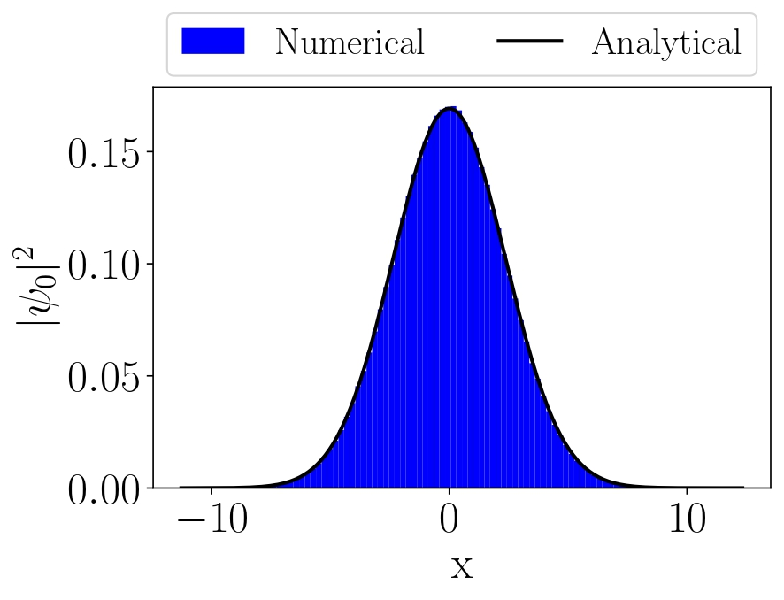
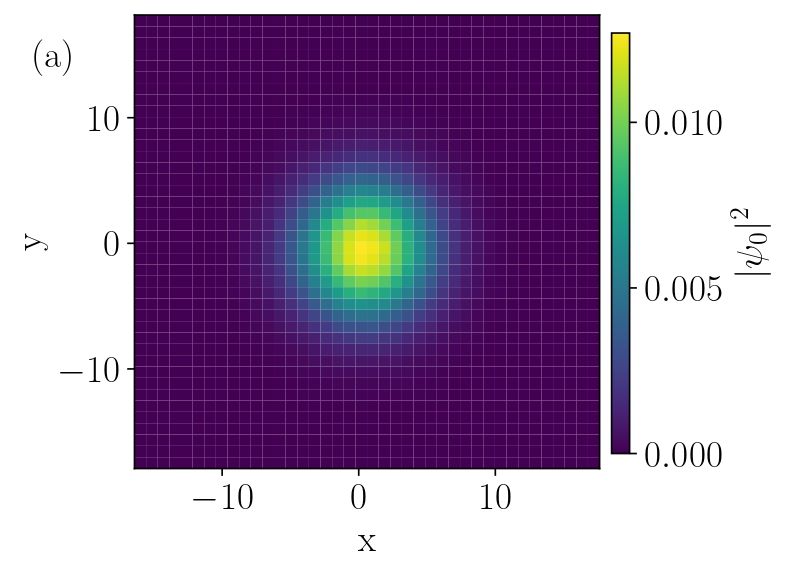
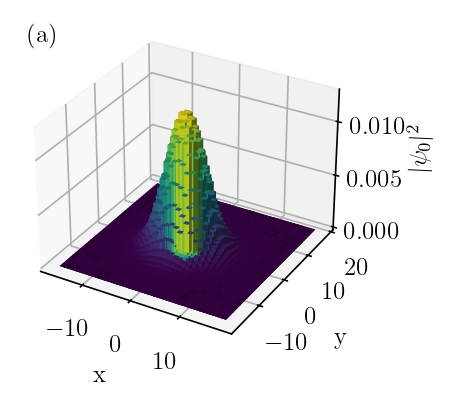

# Path_integral_approach_with_monte_carlo
Feynman’s Path Integral Monte Carlo approach with Metropolis and Lattice Quantum Mechanics algorithm:

# README: Feynman's Quantum Path Integration - Monte Carlo Simulation with Metropolis and Lattice Quantum Mechanics Algorithm:

## Overview
This project implements a 1D and 2D Feynman's Quantum Path Integral Monte Carlo (PIMC) approach for solving the ground state wavefunction of a harmonic oscillator using a variational method. The code utilizes the Metropolis algorithm to update paths and estimate the system's quantum properties.

### Project Information:
- **Course**: ENPH/PHYS 479/879 - High Performance Computational Physics (Winter Term, 2022)
- **Project Title**: Feynman's Quantum Path Integration - Variational Approach to Ground State Wavefunction of Quantum Oscillator
---

## Setup Instructions

Before running the code, please ensure that you are using the correct Python environment and have installed all necessary dependencies. Additionally, you need to enable matplotlib's interactive mode for visualization by applying the following command in your console:

```python
%matplotlib auto
```

This command ensures that matplotlib updates the plot dynamically.
---
## File Overview:

For the details of the project please read the PDF file: **"Research_project_of_879.pdf"**.

There are five Python files:

Please apply "%matplotlib auto" to the console before run the following code.
**FPIMC_1d2dv3.py:** It is unparallelized 1d and 2d Feynman's Quantum path integral Monte Carlo (FPIMC) approach, solved
          	 ground state wavefunction with harmonic oscillator. The computational method used Metropolis Algorithm.
		 The 1d FPIMC has validated with the analytical solution of ground state probability distribution and 
		 values of $\braket{x}$, $\braket{x^2}$, $\braket{x^3}$ and $\braket{x^4}$ and ground state energy of harmonic oscillator.
		
**FPIMC_3dv0.py:** It is unparallelized 3d Feynman's Quantum path integral Monte Carlo (FPIMC) approach, solved
               ground state wavefunction with harmonic oscillator. It hasn't validate with any analytical solutions. 
	       The three dimensional python has not complete since, I am not sure how to plot 4 dimensional $|\psi(\mathbf{r},t)|^2$, 
	       but I think that I accidentally plot the first excitation probability distribution from it. I am not sure if it is 
	       correct, so I did not report it in my final report. 

**FPIMC_Numbav0.py:** Apply only numba to 2d ground state wavefunction with Feynman's Quantum path Integral Monte Carlo (FPIMC).

**FPIMC_MPI2dv0.py:** Parallel simulation (MPI4py) code with numba to 2d ground state wavefunction with Feynman's Quantum path Integral Monte Carlo (FPIMC).

**Computational time.py:** Plot the simulation time from 2D Path Integral MC with various cores and nodes with numba

Excel file is just to record the simulation time. 

## Code Overview

The code consists of several subroutines, each addressing specific parts of the Quantum Path Integral Monte Carlo approach:

- **Path_Integral_MC**: Main function that implements the Path Integral Monte Carlo (PIMC) simulation using the Metropolis algorithm.
- **Paths_generator**: Generates the paths for the simulation.
- **Path_Integral_MC2d**: Extension of the 1D path integral method to 2D.
- **Action**: Calculates the action \( S \) at each point in the path (Equation 9 in the report).
- **V**: Defines the potential function for the harmonic oscillator \( V(x) = \frac{1}{2}m\omega^2x^2 \).
- **graph**: Visualizes the path evolution during the simulation.
- **Expectations**: Computes various expectation values such as \( \langle x \rangle \), \( \langle x^2 \rangle \), \( \langle x^3 \rangle \), and \( \langle x^4 \rangle \).
- **ground_state_energy**: Calculates the ground state energy based on the expectation values of \( \langle x^2 \rangle \) and \( \langle x \rangle \).

---

## Main Simulation Flow

### 1D Quantum Path Integral (PIMC) Simulation
- The primary function **Path_integral_MC** iteratively updates the path using the Metropolis algorithm. It calculates the action and accepts or rejects the new path based on the change in action.
- A visualization of the evolving path is shown during the simulation using **graph**.

### Monte Carlo Simulation
- The simulation runs for **N_paths** paths, each evolving over **timesteps** steps, with each step applying the **Path_integral_MC** function. The resulting paths are stored in **path_arr**.
  
### Expectation Value Calculation
- The expectation values of various powers of position, \( \langle x^n \rangle \), are calculated over the generated paths. These are used to calculate properties like the ground state energy.

### Ground State Energy
- The ground state energy is computed using the formula \( E_0 = m\omega^2(\langle x^2 \rangle - \langle x \rangle^2) \), where \( \langle x \rangle \) and \( \langle x^2 \rangle \) are the expectation values of the position and the square of the position.

---

## Code Usage

### Parameters:
- **dt**: Time step (default = 0.3)
- **Nsteps**: Number of steps in the path (default = 100)
- **timesteps**: Number of time steps to simulate (default = 100)
- **h**: Step size change per timestep (default = 0.1)
- **m**: Mass (default = 1)
- **omega**: Angular frequency (default = 1)

You can modify these parameters in the script to experiment with different configurations.

### Running the Simulation:
To run the simulation, simply execute the script. The path evolution will be displayed in real time, and the final output will be the comparison of numerical and analytical solutions for the probability distribution, as well as the calculated ground state energy.

### Example Outputs:
- **Ground state energy** calculated as a function of \( \Delta t \).
- **Probability density** for the ground state, comparing numerical and analytical solutions.
- **Path visualization** showing the evolution of the particle's path over time.

---

## Required Libraries

Ensure that you have the following libraries installed:

- `numpy`: For numerical computations.
- `matplotlib`: For visualizations.
- `numba`: For just-in-time compilation to speed up the code.

You can install them using `pip`:
```bash
pip install numpy matplotlib numba
```

---
Comparison of numerical solution of 1D Feynman’s Path Integral with analytical probability distribution of 1D ground-state wavefunction on Harmonic Oscillator, where numerical result is demonstrated in histogram with bins = 40, 5000 paths, 200 time slices and 100 timesteps; the black curve
is analytical result obtain from 1D ground-state wavefunction with the Harmonic Oscillator:
<p align="center">

</p>

The two-dimensional plot of numerical and analytical probability distribution of 2D ground-state wavefunction on Harmonic Oscillator. Numerical 2D Path for 10000 paths, 100 time slices and 100 timesteps and plot in histogram with bins = 40:
<p align="center">

</p>

The three-dimensional plot of numerical and analytical probability distribution of 2D ground-state wavefunction on Harmonic Oscillator. Numerical 2D Path for 10000 paths, 100 time slices and 100 timesteps and plot in histogram with bins = 40:
<p align="center">

</p>

## Acknowledgements

This project was completed as part of the ENPH/PHYS 479/879 course under the guidance of Prof. S. Hughes at Queen's University. It implements the quantum path integral approach to simulate the ground state of a quantum harmonic oscillator.

